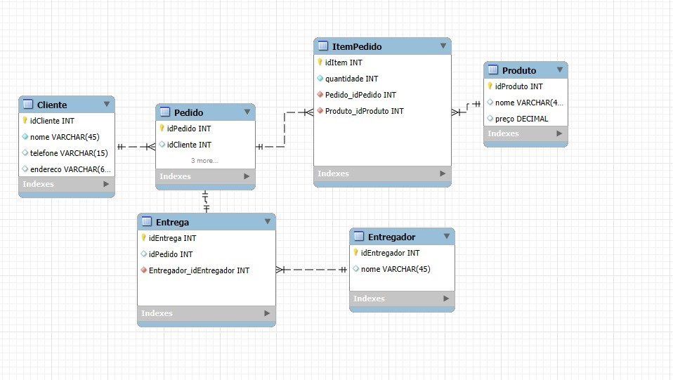

# Diner Database Schema (SQL Project)

This project is a university assignment focused on relational database design and SQL. I have modeled and implemented a complete database schema for a fictional diner system, covering entities from clients and orders to products and deliveries.

## Entity-Relationship Diagram (ERD)

This diagram illustrates the database structure, tables, and their relationships.

 
---

## Key Concepts and Skills Demonstrated

This project showcases fundamental database skills:

- **Database Modeling:** Designing a relational schema with 6 interconnected tables to represent a real-world business scenario.
- **DDL (Data Definition Language):** Writing `CREATE TABLE` scripts to build the database structure, using primary keys, foreign keys, and appropriate data types.
- **DML (Data Manipulation Language):** Using `INSERT INTO` to populate the database with sample data.
- **DQL (Data Query Language):** Writing complex queries with multiple `JOIN`s to retrieve meaningful reports from the interconnected data.

---
